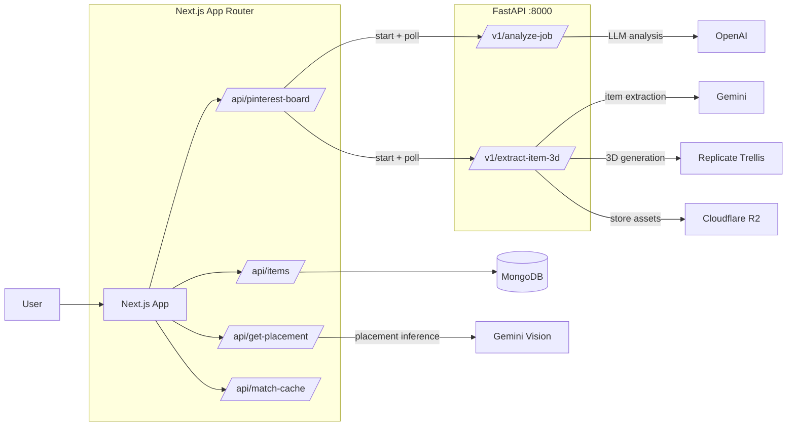

<h1 align="center">
    Déjà View
</h1>
<p align="center">
    <strong>From inspiration to identity.</strong><br>
    Turn your Pinterest saves into 3D objects in your room — keep what you touch, let the rest fade.
</p>

<p align="center">
    <!-- ADD DEMO LINK: <a href="https://your-demo-url.com"></a> -->
</p>

<p align="center">
    <a href="https://www.youtube.com/watch?v=jmkodGzbENg">
        
    </a>
    <br>
    <em>Click to watch the demo</em>
</p>


## The Pipeline

See how Déjà View transforms your Pinterest inspiration into interactive 3D objects:

| Pinterest | 2D Render | 3D Model |
|:---------:|:---------:|:--------:|
|  |  |  |
| *Source inspiration* | *AI-extracted product* | *Generated 3D model* |

## How It Works

1. **Save**: Collect inspiration on a public Pinterest board
2. **Import**: Paste your board URL — we analyze each pin and extract the main item
3. **Generate**: AI creates a realistic 2D render, then converts it to a 3D `.glb` model
4. **Place**: Objects appear naturally in your virtual room
5. **Interact**: Click items to inspect, adjust placement, or shop similar products
6. **Curate**: What you touch stays; what you ignore fades — your space reflects you

## Quick Start

### Prerequisites

- Node.js 18+
- Python 3.10+
- API keys: Clerk, Gemini, Replicate, Cloudflare R2, Google CSE

### Frontend (Next.js)

```bash
cd deja-view
npm install
cp env.example .env.local
# Fill in your API keys
npm run dev
```

App runs at `http://localhost:3000`

### Backend (FastAPI)

```bash
cd pinterest-extraction
python3 -m venv venv
source venv/bin/activate
pip install -r requirements.txt
cp env.example .env
# Fill in your API keys
uvicorn app.main:app --reload --port 8000
```

API docs at `http://localhost:8000/docs`

## Architecture



### Tech Stack

**Frontend**
- Next.js 14 & React
- Three.js for 3D rendering
- Clerk for authentication
- Framer Motion & GSAP for animations

**Backend**
- FastAPI with async job polling
- Gemini for item extraction & placement
- Replicate Trellis for 3D `.glb` generation
- MongoDB for data persistence
- Cloudflare R2 for asset storage

## Inspiration

University students express identity through their space, but buying furniture from flat images leads to regret and costly returns. Inspiration stays trapped in static Pinterest boards — disconnected from the real constraints of your room.

Déjà View bridges that gap: discover → visualize in 3D → decide with context → shop what truly belongs.

## Team

- **Julian Laxman** — Product & Integration
- **David Liu** — Web App & UX
- **Alan Xue** — Commerce Integration
- **Charles Bae** — Backend Pipeline

---

<p align="center">
    Built at UofTHacks 13
</p>
