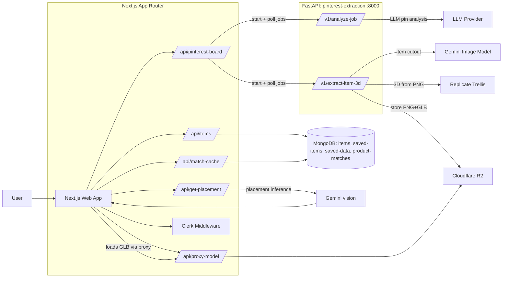

# Déjà View

**From inspiration to identity.**

Identity isn't made of facts — it's the colors you gravitate toward, the corners you return to, the objects you keep. The world you build around you.

Déjà View turns what you save online into 3D objects inside your room, so you can feel what fits before you buy, and curate a space that reflects who you are.

- **Theme**: Identity — your "saved" folder becomes a living space where things you touch stay, and things you ignore fade
- **Stack**: Next.js 14 + Three.js + FastAPI + MongoDB + Cloudflare R2 + Gemini + Replicate (Trellis)
- **Standout feature**: Pinterest board → AI extraction → 3D `.glb` generation → natural placement in your room
- **Experience**: "Resonance Test" — items you interact with stay; items you ignore drift away
- **Demo**: [Devpost submission](https://devpost.com/software/deja-view)

> **Judges: 60-second overview**
>
> **The insight**: If your room is part of your identity, then the things you discover online shouldn't stay trapped in a Pinterest board — they should step into your space, be felt, noticed, and chosen.
>
> **What we built**: Déjà View connects discovery → creation → placement → purchase. Point it at a public Pinterest board; it extracts the main item from each pin, generates a realistic 3D `.glb`, places it naturally in a room scene, and surfaces matching products you can actually buy. Over time, items you ignore fade; items you interact with stay — so what remains truly reflects you.

---

## Why this matters

University students express identity through their space, but buying furniture from flat images leads to "does it fit?" regret, wasted time, and costly returns. Inspiration stays trapped in static folders — disconnected from the real constraints of your room (size, layout, what already exists).

## What it does (plain language)

Déjà View turns online inspiration into a living virtual room:

1. **Collect inspiration**: Save Pinterest posts to a board → Déjà View pulls them in
2. **Bring it into your room**: We identify the item, generate a realistic 2D render, convert it to 3D, and place it naturally in your space
3. **Decide with context**: Tap an object to see details, shop similar products, or save its placement
4. **Shop the pieces that truly belong**: We generate search queries and surface real matching products
5. **Resonance Test** *(design concept)*: Items you interact with stay; items you ignore drift away over time

---

## Demo walkthrough (judge script)

1. **Landing page**: "From inspiration to *identity*" — sign in with Clerk
2. **Paste your Pinterest board URL** (the folder where you save things that speak to you)
3. The app analyzes each pin in the background (async job with progress tracking)
4. For each pin: extracts **one main item** (e.g., "beige velvet sofa"), captures style/material/color
5. Generates a **realistic 2D product render** → converts to **3D `.glb`** → uploads to R2
6. **Enter the room view**: new objects appear as they finish generating
7. **Interact**: click an object → see its label, adjust placement, or tap "shop similar"
8. **Shop matching products**: cached search results show real items you can buy
9. **What you touch stays; what you ignore fades** — the space evolves to reflect your true preferences

---

## What makes it different (vs obvious alternatives)

- **Vs. Pinterest / moodboards**: Moodboards are *visual bookmarking* — a static archive. Déjà View turns your board into **interactive, spatially constrained objects** in a living room. What you save leaves a trace; what you touch stays.
- **Vs. AR "place in your room" shopping apps**: AR apps require a product catalog first. Déjà View starts with *inspiration*: **any Pinterest image → extracted item → generated 3D asset → placed in context**, then connects to real products.
- **Vs. "image search for similar products"**: Image search returns links. Déjà View gives you a **3D proxy** to evaluate fit/scale/placement *before* you decide, then surfaces matching products when you're ready to buy.

---

## Technical deep dive (readable)

### Architecture (Mermaid)



### Key flows

- **Pinterest → Items in DB**
  - Next.js calls FastAPI `POST /v1/analyze-job` then polls `GET /v1/analyze-job/{job_id}`
  - For each analyzed pin with a main item, Next.js starts `POST /v1/extract-item-3d` and polls until done
  - Resulting `{ result_image_url, model_glb_url }` is saved to MongoDB (`items` collection)

- **Shop matching (fast + cacheable)**
  - Build a search query from item signals (colors/materials/style + description)
  - Query discovery via Google Programmable Search (CSE)
  - Normalize Shopify product pages (`/products/...`) and rank
  - Cache results in MongoDB (`product-matches`, TTL-based)

- **Placement (plausible + safe)**
  - Gemini inference provides an initial placement proposal
  - Server-side post-processing clamps to room bounds, snaps rotation, and applies collision-ish heuristics to reduce clipping/floaty placements

### Hard problems solved (and how)

- **Multi-step reliability** — "this project is basically a relay race; if one handoff fails, everything fails"
  - Async job endpoints with polling to avoid request timeouts (`/v1/analyze-job`, `/v1/extract-item-3d`)
  - Bounded concurrency (max 3 concurrent 3D jobs), graceful fallbacks per step
- **Accurate 3D model generation from Pinterest images**
  - Chaining Pinterest → AI prompt → 2D render → 3D conversion required guardrails at every step
  - Solution: Gemini for item extraction + Nano Banana Pro for realistic render + Trellis for `.glb`
- **Placement that "makes sense"**
  - It's not enough to place an object somewhere valid — it needs to feel natural in context (floor vs surface, near walls, not clipping, not floating)
  - Solution: Gemini placement inference + deterministic post-processing (clamping, snapping, collision heuristics)
- **Turning unstructured inspiration into structured commerce intent**
  - Extract main item + style/material/color signals → generate search query → dedupe/rank real products
- **CORS + binary asset delivery**
  - `.glb` assets proxied through Next.js backend to avoid CORS issues from R2 storage

### Notable engineering decisions / tradeoffs

- **Public boards only**: ingestion is built around scraping public Pinterest boards (no private boards).
- **Job state**: FastAPI job state is in-memory (fast for a hackathon, but not durable across restarts).
- **Caching strategy**:
  - In-memory cache for certain match results (minutes)
  - MongoDB cache for product matches (hours/day-scale TTL)
- **“3D models are proxies”**: `.glb` models are generated from a single image; they’re good for spatial intuition, not manufacturing-grade CAD.

### Performance / reliability notes (truthful, with sources)

- **Board analysis**: ~2–5 seconds per pin (typical), depends on LLM latency.
- **3D generation**: ~30–120 seconds per item (typical), depends on Replicate queue time.
- **Concurrency**: 3D jobs are capped (max 3 concurrent) to avoid API overload.

> These timings are based on the backend service documentation and are variable by network + provider load.

### Security & privacy considerations

- **Secrets**: all API keys are provided via environment variables (no keys checked in).
- **Scope**: Pinterest ingestion is limited to **public** boards; no attempt is made to access private content.
- **Storage**: generated assets (PNG + GLB) are stored in Cloudflare R2; the app stores metadata and transform state in MongoDB.
- **CORS**: the FastAPI service is configured permissively for hackathon iteration (`allow_origins=["*"]`).

### APIs / services used

- **Clerk** (auth)
- **MongoDB** (items, saved state, caching)
- **Cloudflare R2** (asset storage)
- **Google Programmable Search (CSE)** (product discovery)
- **Gemini** (item extraction + placement inference)
- **Replicate Trellis** (3D `.glb` generation)

---

## Design (UX rationale)

- **Identity-first loop**: The UI frames "inspiration" as something you *keep or let go*, not a list you hoard. Good design helps people make choices *on purpose*, so what they keep actually reflects who they are.
- **"What you save leaves a trace"**: The landing page sets the tone — items you touch stay, the rest fades. The room becomes an honest reflection of your preferences.
- **Motion with intent**: Subtle transitions + micro-interactions (built with Framer Motion + GSAP) track cause/effect — you feel the connection between saving a pin and seeing it appear in your room.
- **Polished, production-ready feel**: Custom design tokens, serif headlines, refined spacing — we wanted it to feel like a real product, not a prototype.
- **Usability/accessibility basics**
  - Focusable interactive elements with visible focus styles
  - Respects `prefers-reduced-motion` for all animations
  - Works as a standard web app (no special hardware required)

---

## Completion / status

**What we're proud of**
- ✅ **Full pipeline working**: Pinterest → Gemini → Nano Banana (2D) → Trellis (3D) → placed in-room
- ✅ **Polished experience**: micro-interactions, motion design, and a modern UI that feels production-ready
- ✅ **Identity → outcome**: connected the "what you save" experience to real commerce via product matching

**What works now**
- Public Pinterest board ingestion (async jobs with progress tracking)
- End-to-end pipeline: board analysis → item extraction → `.glb` generation → natural placement
- 3D room viewer with object interaction (click to inspect, save transforms)
- "Shop similar" product matching with MongoDB caching
- All assets stored in Cloudflare R2, metadata in MongoDB Atlas

**Known limitations / future work**
- **Resonance Test** (items drift/fade if ignored) is a design concept, not yet implemented in the live build
- FastAPI job state is **in-memory** (jobs lost on service restart; would move to Redis/DB for production)
- Placement is best-effort AI + heuristics; complex room layouts can still produce awkward results
- Private Pinterest boards not supported (scraping requires public access)
- Video/LiDAR → 3D room conversion was harder than expected; currently using pre-generated room models

---

## Setup (run locally)

### Prereqs

- **Node.js** (for the Next.js app)
- **Python 3.8+** (for `pinterest-extraction`)
- Accounts/keys for: **Clerk**, **Gemini**, **Replicate**, **Cloudflare R2**
- Optional but recommended: **MongoDB Atlas** (or a local MongoDB)

### 1) Web app (Next.js)

```bash
cd /path/to/deja-view
npm install
cp env.example .env.local
```

Fill `.env.local` (minimum set varies by which features you demo):

- **Clerk**
  - `NEXT_PUBLIC_CLERK_PUBLISHABLE_KEY=...`
  - `CLERK_SECRET_KEY=...`
- **MongoDB**
  - `MONGODB_ATLAS_URI=...` (or `MONGODB_DEV_URI=...`)
  - `MONGODB_DB=deja-view` (optional)
- **Gemini (placement)**
  - `GOOGLE_GEMINI_API_KEY=...` (or `GEMINI_API_KEY=...`)
- **Google CSE (product matching)**
  - `GOOGLE_CSE_API_KEY=...`
  - `GOOGLE_CSE_ID=...`
- Optional
  - `REPLICATE_API_TOKEN=...` (used by the backend service)
  - `PINTEREST_SERVICE_URL=http://localhost:8000`

Run:

```bash
npm run dev
```

App: `http://localhost:3000`

### 2) Pinterest Extraction API (FastAPI)

```bash
cd pinterest-extraction
python3 -m venv venv
source venv/bin/activate
pip3 install -r requirements.txt
```

Create `pinterest-extraction/.env` with:

- `OPENAI_API_KEY=...` (board analysis LLM provider)
- `GEMINI_API_KEY=...` (item extraction)
- `REPLICATE_API_TOKEN=...` (3D generation)
- `R2_ACCOUNT_ID=...`
- `R2_ACCESS_KEY_ID=...`
- `R2_SECRET_ACCESS_KEY=...`
- `R2_ENDPOINT=https://<ACCOUNT_ID>.r2.cloudflarestorage.com`
- `R2_BUCKET=...`
- `R2_PUBLIC_BASE_URL=...`

Run:

```bash
uvicorn app.main:app --reload --port 8000
```

Health check: `http://localhost:8000/health`  
Docs: `http://localhost:8000/docs`

---

## Deployment

This repo is designed to be easy to demo locally. If you want to deploy it, the minimal split is:

- **Next.js app**: deploy as a standard Node Next.js app (e.g., Vercel/Render/Fly)
- **FastAPI service**: deploy separately (e.g., Render/Fly) and set `PINTEREST_SERVICE_URL`
- **MongoDB Atlas**: hosted DB
- **Cloudflare R2**: asset storage

---

## What we learned

Building "multi-step, multi-API" systems is less about any single model — it's about designing clean interfaces between steps, adding fallbacks, and pushing through integration friction.

**Identity changes over time.** Good design helps people make choices on purpose, so what they keep actually reflects who they are.

---

## What's next

- **Design**: Fully implement "Resonance Test" — items drift daily for 3 days, disappear if never touched, with clear affordances + undo
- **Completion**: Durable job queue (replace in-memory state with Redis/DB-backed queue)
- **Relevance (Shopify track)**: Stronger Shopify integration — catalog-level availability, variants, real-time pricing, checkout handoff
- **Innovation**: 
  - **Aesthetic understanding**: recommend items based on the room's existing style and user interaction patterns
  - Implicit preference learning to rank future pins automatically
- **Technicality**: 
  - Video/LiDAR → 3D room conversion: turn casual room capture into usable interior spaces
  - Multi-view 3D generation or segmentation + mesh cleanup for higher-fidelity assets
- **Expansion**:
  - **Multi-room stitching**: connect multiple scans into one continuous apartment/home
  - **Beyond interiors**: clothing and wearable identity using the same "discover → visualize → choose" loop
  - **VR mode**: step into your evolving space and curate it in full immersion

---

## Team, contributions, acknowledgements

- **Julian Laxman** — product + integration
- **David Liu** — web app / UX
- **Alan Xue** — commerce/search integration
- **Charles Bae** — backend pipeline

Acknowledgements:
- UofTHacks 13 + Shopify track prompt for pushing “AI meets commerce” experimentation.
