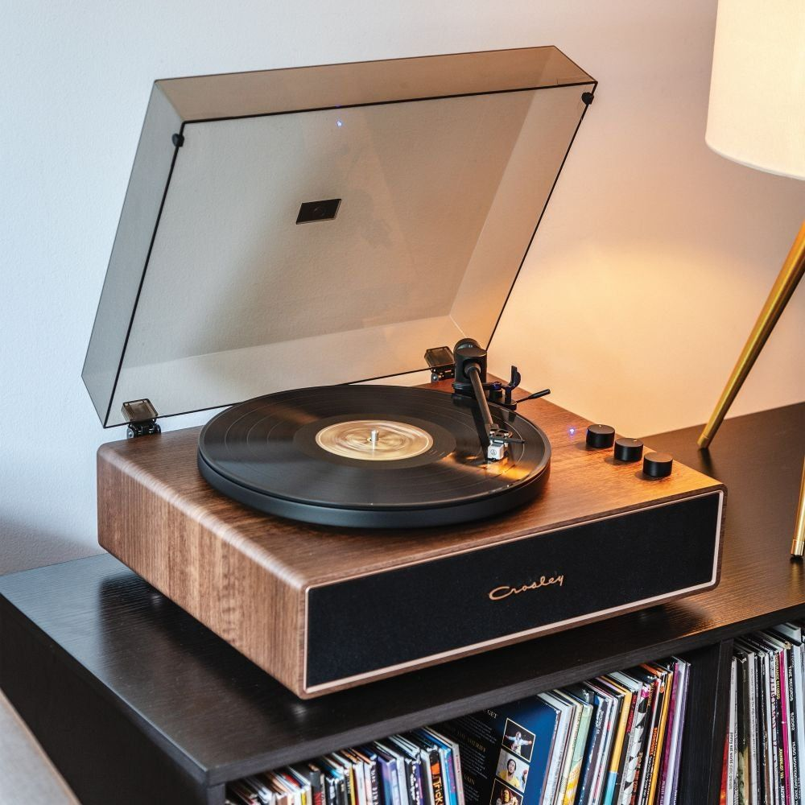
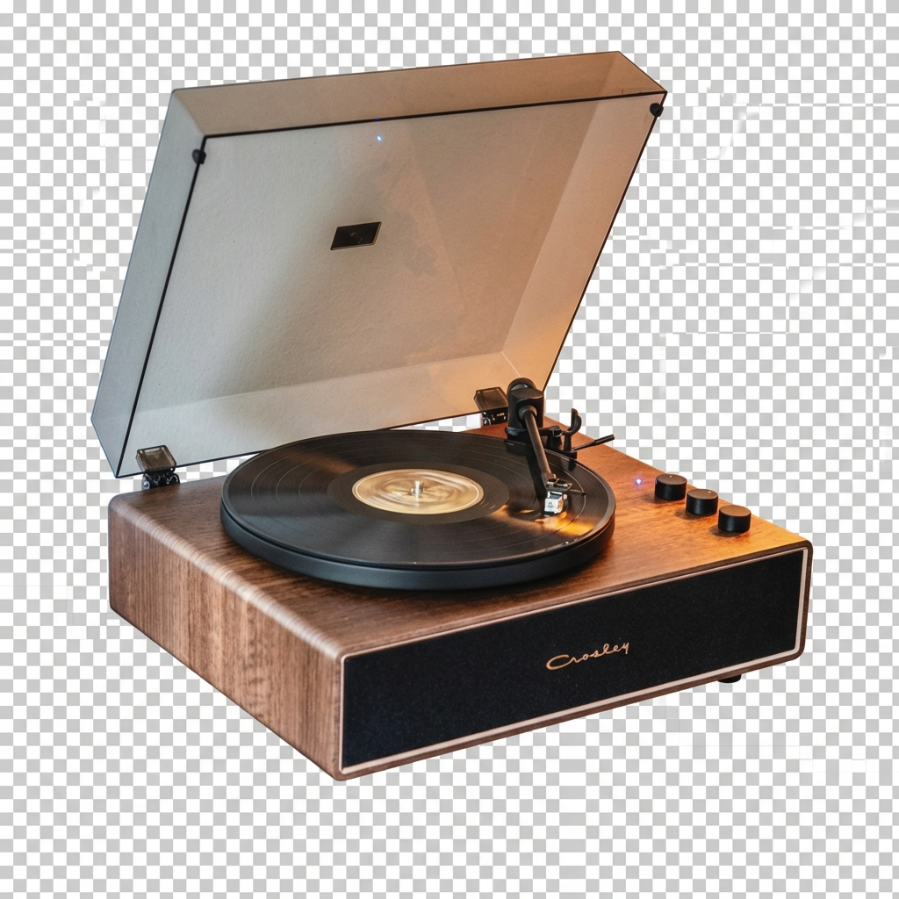

<h1 align="center">
    Déjà View
</h1>

    <strong>From inspiration to identity.</strong> 
    Turn your Pinterest saves into 3D objects in your room — keep what you touch, let the rest fade.

    <!-- ADD DEMO LINK:  -->

https://github.com/user-attachments/assets/c901eec9-86a6-4149-9e51-66fe814d9101

 

<table>
  <tr>
    <td align="center" width="50%">
      
       
      <em>Landing Page</em>
    </td>
    <td align="center" width="50%">
      
       
      <em>3D Room View</em>
    </td>
  </tr>
</table>

 

## The Pipeline

See how Déjà View transforms your Pinterest inspiration into interactive 3D objects:

<table>
  <tr>
    <th align="center" width="33%">Pinterest</th>
    <th align="center" width="33%">2D Render</th>
    <th align="center" width="33%">3D Model</th>
  </tr>
  <tr>
    <td align="center">
      
    </td>
    <td align="center">
      
    </td>
    <td align="center">
      
    </td>
  </tr>
  <tr>
    <td align="center"><em>Source inspiration</em></td>
    <td align="center"><em>AI-extracted product</em></td>
    <td align="center"><em>Generated 3D model</em></td>
  </tr>
</table>

 

## How It Works

1. **Save**: Collect inspiration on a public Pinterest board
2. **Import**: Paste your board URL — we analyze each pin and extract the main item
3. **Generate**: AI creates a realistic 2D render, then converts it to a 3D `.glb` model
4. **Place**: Objects appear naturally in your virtual room
5. **Interact**: Click items to inspect, adjust placement, or shop similar products
6. **Curate**: What you touch stays; what you ignore fades — your space reflects you

 

## Architecture

 

## Inspiration

University students express identity through their space, but buying furniture from flat images leads to regret and costly returns. Inspiration stays trapped in static Pinterest boards — disconnected from the real constraints of your room.

Déjà View bridges that gap: discover → visualize in 3D → decide with context → shop what truly belongs.

 

## Team

| Name | Role |
|:-----|:-----|
| **David Liu** | Web app, UI/UX, product, video/LiDAR → 3D room model |
| **Julian Laxman** | Pinterest integration, Pinterest → 2D → 3D pipeline, backend integration |
| **Alan Xue** | Shopify integration, UI/UX, Web app, Google PSE API -> MongoDB pipeline integration |
| **Charles Bae** | 3D room modeling & object placement logic, Three.js integration, system components integration|

---

    Built at UofTHacks 13

